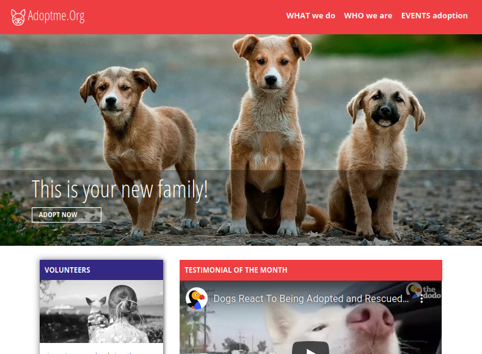

# pet adoption site
## Digital Transformation Example
Pet Adoption Agency website. Built on vue.js, node, and bootstrap-vue. The site consists of several article style pages, a home page with video content, a basic article feed, and a large picture banner. 



## Project setup
The backend of this project is a simple, one file node server created using express. All it does is send the json of a youtube video upon request. To set it up:
```
cd backend
npm install
```
The frontend of this project is written in Vue.js. Dependencies include **bootstrap-vue** for layout, **sass** for css pre-processing, and **pug** as an html pre-processor. Setup:
```
cd vue-front
npm install
```

## Running the project
After installing dependencies, get the **backend** going on **port 8080** with:
```
cd backend
node app.js
```
And get the **frontend** going on **port 3000** with:
```
cd vue-front
npm run serve
```

### To Compile and Minify Frontend for Production
```
npm run build
```
